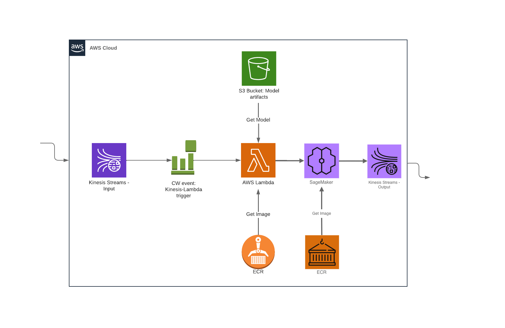
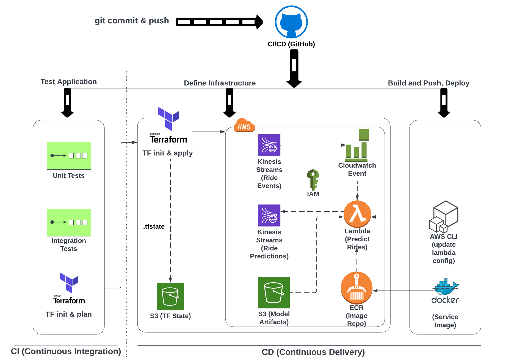

# SmartSearch — Text-to-SQL MLOps Pipeline


> **End-to-end MLOps system** — fine-tunes Phi-3-mini (3.8B) on 78k SQL examples via QLoRA, serves a 2.2 GB GGUF model on a GPU SageMaker endpoint, processes queries asynchronously through Kinesis + Lambda, and feeds production failures back into training via an Airflow active-learning loop.

---

## AWS Inference Pipeline

<p allign="center">
  
</p>

**Request flow:**
- `POST /query` → API Gateway → **Kinesis** (returns `202 Accepted` immediately)
- Kinesis → **Lambda** (ARM64, batch trigger) → **SageMaker** (ml.g4dn.xlarge · NVIDIA T4 · CUDA 11.8)
- Success → **DynamoDB** `{sql, rows, latency_ms}` · Failure → **S3** `failed_sql/YYYY/MM/DD/`

---

## CI/CD & Infrastructure Pipeline

<p allign="center">
  
</p>

**Delivery flow:**
- `git push` → GitHub Actions → unit tests + integration tests (LocalStack) + mypy + ruff
- Terraform provisions: Kinesis · DynamoDB · Lambda · API Gateway · SageMaker · EC2 monitoring
- Docker images tagged by git SHA → pushed to **ECR** → wired into Lambda + SageMaker via Terraform output

---

## Engineering Highlights

**ML & Training**
- QLoRA fine-tune: 4-bit NF4 quantisation + LoRA r=64, α=128 on all 7 attention/FFN projections
- Dataset: `b-mc2/sql-create-context` · 78k examples · 95/5 train/val split · 3 epochs
- **Execution Accuracy (EX)** metric — generates SQL, runs predicted vs gold against in-memory SQLite, compares row sets
- MLflow tracks: loss curves, EX per eval step, hyperparams, GGUF artifact

**Inference**
- GGUF Q4\_K\_M (2.2 GB) baked into ECR image — no runtime download, cold start = model init only
- `n_gpu_layers=-1` offloads all layers to T4 GPU · **~1–3 s** inference vs ~39 s CPU
- tenacity retry (3 attempts, exponential backoff) on SageMaker calls from Lambda

**Observability**
- Lambda: 10 Prometheus metrics per invocation (duration, retries, batch size, result rows, …)
- SageMaker: 3 metrics pushed every 15 s via background thread → Pushgateway → Prometheus → Grafana
- 2 Grafana dashboards: **Operational** + **ML Quality**
- Evidently daily data-quality report → S3 · SLO metrics → MLflow experiment `text2sql-monitoring`

**Active Learning**
- Airflow `@daily` DAG: S3 `failed_sql/{{ ds }}/` → labeled JSONL → `dataset/` bucket
- Production failures automatically feed the next training run

**Cost & Reliability**
- Lambda reserved concurrency = 5 (hard cost cap)
- SageMaker endpoint provisioned on-demand; deleted after test window (~$0.13 / 15 min)
- DynamoDB on-demand + 24 h TTL · Kinesis 1 shard · EC2 t3.small for monitoring (~$0.02/hr)
- 100% IaC — 7 Terraform modules, reproducible in one `terraform apply`

**Code Quality**
- strict `mypy` · `ruff` lint/format · 20+ pytest unit tests · LocalStack integration tests
- `fake-sagemaker` Flask mock for local end-to-end testing without AWS
- `detect-secrets` pre-commit hook

---

## Tech Stack

| Layer | Technologies |
|---|---|
| **ML training** | PyTorch 2.3 · Transformers 4.44 · PEFT · BitsAndBytes · TRL SFTTrainer · MLflow |
| **Model export** | llama.cpp · GGUF · Q4\_K\_M quantisation |
| **GPU inference** | llama-cpp-python (CUDA) · Flask · SageMaker Real-time Endpoint |
| **App / Lambda** | Python 3.11 · Pydantic v2 · boto3 · tenacity · prometheus-client |
| **Async pipeline** | Kinesis · Lambda ARM64 · API Gateway direct integration |
| **Storage** | DynamoDB (TTL) · S3 (3 buckets) · ECR |
| **Observability** | Prometheus · Pushgateway · Grafana · MLflow · Evidently |
| **Orchestration** | Apache Airflow · custom operators |
| **IaC & dev** | Terraform · Docker · Docker Compose · LocalStack |

---

## Repository Layout

```
SmartSearch/
├── ml/           # QLoRA training — model, LoRA config, SFTTrainer, EX metric, GGUF export
├── sagemaker/    # GPU inference container (CUDA 11.8, Flask /ping + /invocations)
├── app/          # Lambda — Kinesis consumer, SageMaker caller, DynamoDB/S3 writer
├── infra/        # Terraform — 7 modules (S3, Kinesis, DynamoDB, Lambda, API GW, SageMaker, EC2)
├── monitoring/   # Prometheus + Grafana + Evidently daily report + MLflow SLOs
├── airflow/      # Active-learning DAG (@daily, custom operators)
├── images/       # Architecture diagrams
└── docs/         # Phase reports, deploy guide, Makefile guide
```

---

## Documentation

**Runbooks — how to run each part:**

| Guide | Covers |
|---|---|
| [`docs/run_local.md`](docs/run_local.md) | Full local dev stack (LocalStack + fake-sagemaker + Lambda RIE), tests, load test |
| [`docs/run_training.md`](docs/run_training.md) | QLoRA pipeline: setup → download → train → export → GGUF (Vast.ai + local) |
| [`docs/run_serving.md`](docs/run_serving.md) | SageMaker inference container: build, env vars, endpoints, local run |
| [`docs/run_monitoring.md`](docs/run_monitoring.md) | Prometheus/Grafana metrics flow + Evidently data-quality DAG |
| [`docs/run_deploy.md`](docs/run_deploy.md) | Build + push ECR images, Terraform apply, E2E test, CI/CD |

Setup: copy [`.env.example`](.env.example) → `.env`. Full command reference:
[`docs/makefile_guide.md`](docs/makefile_guide.md).

**Design reports — why it's built this way:**
[phase1 (ML)](docs/phase1_report.md) ·
[phase2 (app)](docs/phase2_report.md) ·
[phase3 (infra)](docs/phase3_report.md) ·
[phase4 (Airflow)](docs/phase4_report.md) ·
[phase5 (monitoring)](docs/phase5_report.md) ·
[SageMaker migration](docs/sagemaker_report.md) ·
[tests](docs/tests_report.md) ·
[AWS deploy (long-form)](docs/aws_deploy_plan.md)

---

## Quick Start (Local)

```bash
# Full local stack: LocalStack + fake-sagemaker + Lambda RIE
cd app && docker compose up -d

# Tests
uv run pytest tests/ -v                                   # unit
uv run pytest tests/integration/ -v -m integration        # integration (needs LocalStack)

# Quality
uv run ruff check . --fix && uv run ruff format .
uv run mypy .
```

---

## AWS Deployment

Full guide with ECR build, Vast.ai SageMaker image build, Terraform apply, E2E test, and cost cleanup:
**[`docs/aws_deploy_plan.md`](docs/aws_deploy_plan.md)** · Estimated cost per test session: **< $0.20**

---

## Project Phases

| Phase | Deliverable |
|---|---|
| 1 — ML pipeline | QLoRA fine-tune · MLflow tracking · EX metric · GGUF export |
| 2 — Lambda app | Kinesis consumer · SageMaker caller · SQL executor · LocalStack tests |
| 3 — Infrastructure | Terraform: API GW → Kinesis → Lambda → DynamoDB / S3 |
| 4 — Airflow DAG | Daily active-learning: S3 failures → labeled JSONL → dataset bucket |
| 5 — Monitoring | Prometheus · Grafana dashboards · Evidently reports · MLflow SLOs |
| Post-phase | SageMaker migration · GPU Dockerfile · realistic load test (HuggingFace dataset) |
